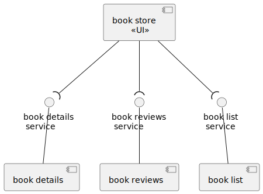

# Bookstore Application

This application is inspired by [istios bookinfo](https://istio.io/latest/docs/examples/bookinfo/) example app.
It is intended to demonstrate modern development practices such as microservices and containerization. The code accompanies a lecture held at TUM Heilbronn.

The main purpose of the application is to expose static information about books via a restful API.

Every component is a separate Spring Boot application, which you can find in its dedicated folder. 

# Getting Started

To start this backend run ``docker-compose build`` and ``docker-compose up``.
To verify if everything is working got to your browser and check the urls http://127.0.0.1/list, http://127.0.0.1/reviews/1 and http://127.0.0.1/details/1 . They should all show valid json responses.